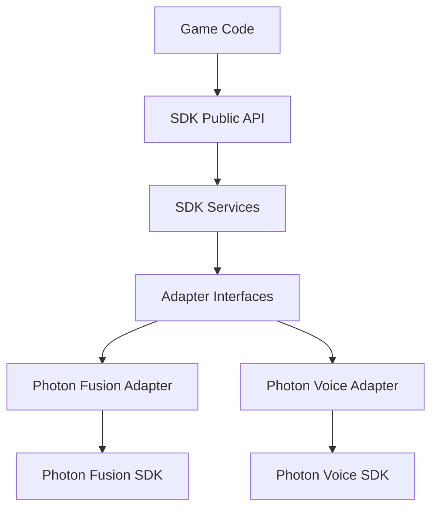
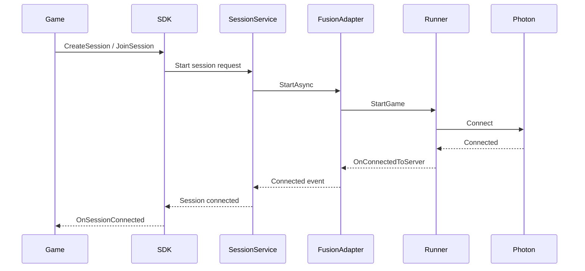
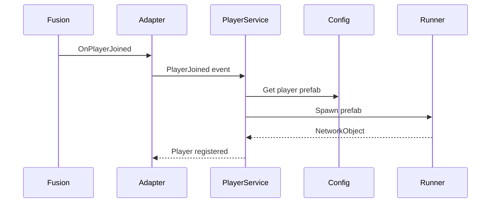

# Photon integration and adapter layer

## Purpose

Photon Fusion and Photon Voice are used **internally** by the SDK only.
Game code talks exclusively to the SDK public API — it never calls a
Photon API directly. This is the same rule as production rule 2 in
`01-architecture.md`, spelled out here at the code level: only the
adapter layer is allowed to import a Photon namespace.

---

## Architecture



Two things matter about this stack: services depend on an **interface**
(`IFusionAdapter`, `IVoiceAdapter`), not a concrete Photon class, and the
concrete Photon implementation sits one layer below that interface. This
is what keeps a future Photon version bump — or even a different network
provider entirely — from rippling up into the services or public API.

---

## Runtime flow

```text
MultiplayerBootstrap
        ↓
Initialize SDK configuration and services
        ↓
Create or detect one NetworkRunner
        ↓
SessionService requests connection
        ↓
FusionAdapter starts Photon session
        ↓
Fusion callbacks become SDK events
        ↓
PlayerService handles spawn/despawn
        ↓
VoiceService starts Photon Voice
```

Three rules fall out of this flow directly:

- The SDK owns the `NetworkRunner` lifecycle end to end — nothing outside
  the adapter creates or destroys one.
- Only one active `NetworkRunner` may exist in a scene (same constraint
  as "one bootstrap per scene").
- Photon Voice only starts **after** the Fusion session has connected
  successfully — voice never races ahead of the session it belongs to.

### Fusion runtime lifecycle — call by call

The step list above compressed into one line each. This sequence diagram
spells out exactly who calls whom, request by request, from the moment
game code asks for a session to the moment it gets confirmation back.



Note the direction change halfway through: everything above the
`Connect` call is a request flowing down the layers; everything below it
is a Photon callback flowing back up, translated at each hop
(`OnConnectedToServer` → `Connected event` → `Session connected` →
`OnSessionConnected`). Game code only ever sees the last, SDK-owned name.

### Player spawn flow — call by call

Once a session is connected, this is what happens the moment Photon
reports a new player:



`PlayerService` never hardcodes which prefab to spawn — it asks
`PlayerConfig.asset` for it on every join, which is what lets a developer
change the player prefab without touching any service code (see the
Player module in `02-module-reference.md`).

---

## Adapter interfaces

```csharp
public interface IFusionAdapter
{
    Task<SdkResult> StartSessionAsync(SessionRequest request);
    Task<SdkResult> LeaveSessionAsync();

    event Action Connected;
    event Action<SdkPlayerId> PlayerJoined;
    event Action<SdkPlayerId> PlayerLeft;
    event Action<SdkError> Failed;
}

public interface IVoiceAdapter
{
    Task<SdkResult> ConnectAsync();
    Task<SdkResult> DisconnectAsync();

    void SetMicrophoneMuted(bool muted);
    void SetSpeakerMuted(bool muted);
}
```

Photon implementations:

```text
IFusionAdapter
    └── PhotonFusionAdapter

IVoiceAdapter
    └── PhotonVoiceAdapter
```

Every method and event on these interfaces uses **SDK-owned types**
(`SdkResult`, `SdkPlayerId`, `SdkError`) — never a raw Photon type. This
is what makes the interface swappable and the services testable with a
mock adapter, independent of Photon being present at all.

---

## Responsibilities

### SDK services

- Control session and voice workflows
- Read configuration
- Track SDK state
- Expose public events
- Decide *when* adapters should start or stop

### Photon adapters

- Call Photon APIs
- Manage Photon references (`NetworkRunner`, `VoiceConnection`, etc.)
- Receive Photon callbacks
- Convert Photon types into SDK types
- Convert Photon errors into SDK errors (`SdkError` — see
  `06-validation-and-errors.md`)

The split is deliberate: services decide *what should happen*, adapters
know *how Photon makes it happen*. Neither side needs to know the other's
internal details beyond the interface.

---

## Important rule — Photon types stay inside the adapter layer

Never expose these from the SDK public API:

```text
NetworkRunner
PlayerRef
NetworkObject
StartGameArgs
ShutdownReason
VoiceConnection
Recorder
Speaker
```

Convert them into SDK-owned models at the adapter boundary:

```text
PlayerRef      → SdkPlayerId
SessionInfo    → SdkSessionInfo
ShutdownReason → SdkError
```

If a Photon type crosses into `SDK Services` or higher, that's a
violation of the layering — it means a future Photon change could break
game code directly, which defeats the entire point of the adapter layer.

---

## Usage during SDK implementation

```csharp
public sealed class SessionService
{
    private readonly IFusionAdapter fusionAdapter;

    public SessionService(IFusionAdapter fusionAdapter)
    {
        this.fusionAdapter = fusionAdapter;
    }

    public Task<SdkResult> JoinAsync(SessionRequest request)
    {
        return fusionAdapter.StartSessionAsync(request);
    }
}
```

`SessionService` depends on `IFusionAdapter`, never on Photon Fusion
directly. This keeps the SDK testable in isolation (swap in a fake
adapter for unit tests) and stops Photon-specific code from spreading
into modules that shouldn't need to know Photon exists.

---

## Do not do

- Do not call `NetworkRunner.StartGame()` from UI code
- Do not create multiple `NetworkRunner`s
- Do not expose Photon callbacks directly to the game
- Do not load configuration inside adapters — adapters receive what they
  need through method parameters, they don't read config assets
  themselves
- Do not put gameplay or UI logic inside adapters
- Do not use Photon types in SDK public models

---

## Suggested structure

```text
Runtime/
├── Services/
│   ├── SessionService.cs
│   ├── PlayerService.cs
│   └── VoiceService.cs
│
├── Abstractions/
│   ├── IFusionAdapter.cs
│   └── IVoiceAdapter.cs
│
└── Adapters/
    └── Photon/
        ├── PhotonFusionAdapter.cs
        └── PhotonVoiceAdapter.cs
```

This slots directly under `Runtime/` in the folder layout described in
`07-project-structure.md` — `Services/` and `Abstractions/` hold
Photon-agnostic code, and `Adapters/Photon/` is the only folder in the
entire SDK allowed to `using Fusion;` or `using Photon.Voice.Unity;`.